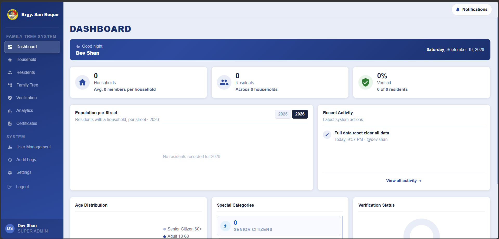
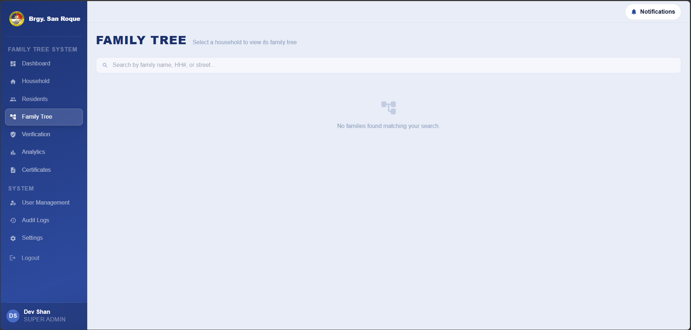
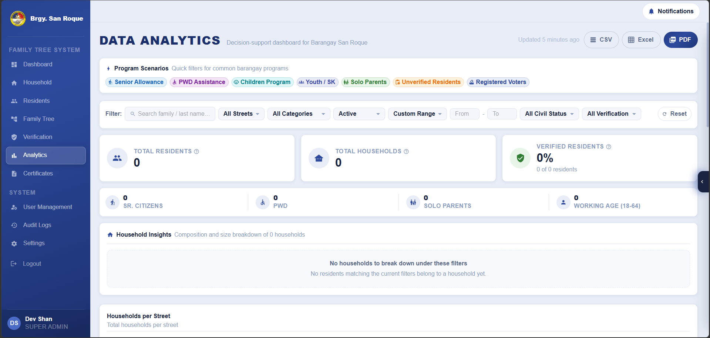
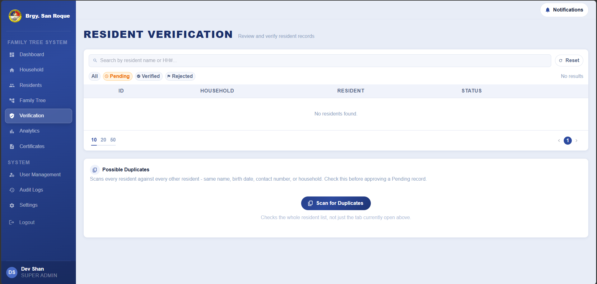
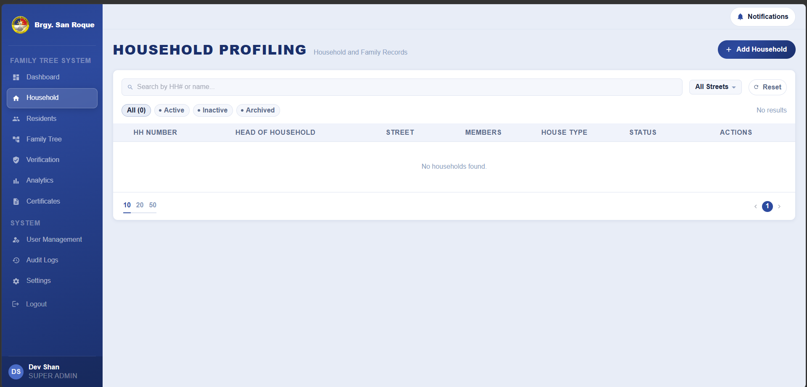
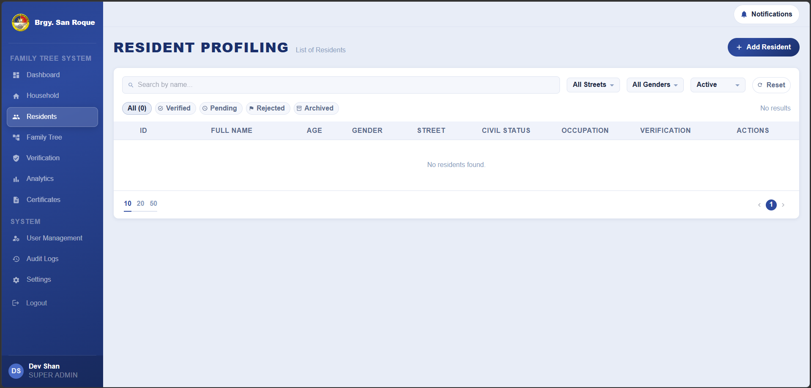
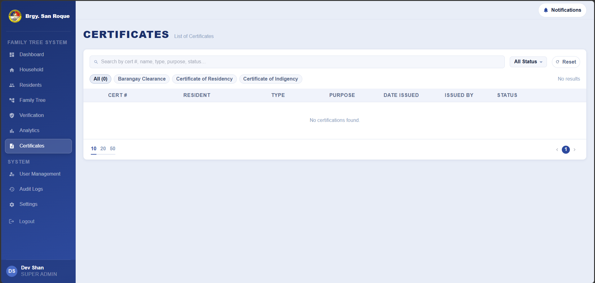

# 🏘️ Barangay San Roque Family Tree System

**Household Profiling, Resident Verification & Data Analytics for real barangay use**

  <a href="#demo">Demo</a> ·
  <a href="#features">Features</a> ·
  <a href="#screenshots">Screenshots</a> ·
  <a href="#tech-stack">Tech Stack</a> ·
  <a href="#team">Team</a>

 

> 📌 This is a **preview/showcase** of the project - screenshots and a feature overview only. The full source lives in a private repository, since this is an active capstone project built with real barangay data in mind.

Most barangays still run their resident and household records on loose Excel sheets and paper folders - easy to lose, hard to search, and impossible to analyze. This system replaces that with a proper, auditable database: households and residents get real records, staff verify what gets submitted, and the barangay gets actual analytics instead of a guess. Built as a BSIT capstone project, but designed to actually be handed off and used by real barangay staff, not just demoed once and shelved.

## Demo

https://github.com/user-attachments/assets/dacdf433-7267-40e0-892a-18a20ef7ceb4

Full-quality version (~7 min): <a href="docs/videos/demo-full.mp4">docs/videos/demo-full.mp4</a>

## Features

<table>
<tr>
<td width="50%" valign="top">

### 🏠 Household & Resident Management
- Registration wizard with auto-generated house addresses
- Demographic, health, and program-eligibility data (PWD, senior citizen, solo parent, OFW, voter status)
- Soft-delete/archive workflow instead of destructive deletes

</td>
<td width="50%" valign="top">

### 🌳 Family Tree
- Interactive, canvas-based visualization per household
- Relationship linking (parent, spouse, sibling, custom)
- Conflict detection on contradictory relationships

</td>
</tr>
<tr>
<td width="50%" valign="top">

### ✅ Verification & Duplicate Detection
- Staff approval workflow for new submissions
- System-wide possible-duplicate scan for similar records
- Manual review only, no silent auto-merge

</td>
<td width="50%" valign="top">

### 📊 Analytics & Reports
- Filterable dashboards (purok, age range, civil status)
- Chart visualizations built on real data
- One consolidated export point (PDF/CSV/Excel)

</td>
</tr>
<tr>
<td width="50%" valign="top">

### 📄 Certificates
- Public self-service requests via a claim-stub ticket, no account needed
- Barangay Clearance, Certificate of Residency, Certificate of Indigency
- Staff-side approval, issuance, and revocation

</td>
<td width="50%" valign="top">

### 💾 Backup & Legacy Import
- One-click backup export/restore for core data
- Bulk import pipeline from an existing barangay Excel sheet
- Preview/validation pass with a scoped undo

</td>
</tr>
<tr>
<td width="50%" valign="top">

### 🔐 Security & Admin Tools
- Role-based access control (Super Admin / Staff)
- Full audit log of system activity
- A "Danger Zone" reset tool for clearing test data pre-launch

</td>
<td width="50%" valign="top">

### 🔔 Notifications & Audit
- Real-time alerts for verification and certificate activity
- Every action traceable back to who did it and when

</td>
</tr>
</table>

## Screenshots

<table>
  <tr>
    <td align="center" width="50%">
       
      <b>Dashboard</b>
    </td>
    <td align="center" width="50%">
       
      <b>Family Tree</b>
    </td>
  </tr>
  <tr>
    <td align="center" width="50%">
       
      <b>Analytics &amp; Reports</b>
    </td>
    <td align="center" width="50%">
       
      <b>Resident Verification</b>
    </td>
  </tr>
  <tr>
    <td align="center" width="50%">
       
      <b>Household Management</b>
    </td>
    <td align="center" width="50%">
       
      <b>Resident Profile</b>
    </td>
  </tr>
  <tr>
    <td align="center" width="50%">
       
      <b>Certificate Requests</b>
    </td>
    <td width="50%"></td>
  </tr>
</table>

## Tech Stack

<table>
<tr><td><b>Frontend</b></td><td>React, Vite, MUI, React Hook Form, Zod, TanStack Query, React Flow</td></tr>
<tr><td><b>Backend</b></td><td>Node.js, Express, Sequelize, PostgreSQL</td></tr>
<tr><td><b>Auth</b></td><td>JWT via httpOnly cookies, role-based access control</td></tr>
</table>

## Team

**Developer:** Master ([@cdwthmstr](https://github.com/cdwthmstr))

Built as part of **Team ERROR 404**'s BSIT capstone project at **Dalubhasaang Politekniko ng Lungsod ng Baliwag**, Institute of Information Technology and Innovation.

---

Showcase repository - no source code, no real resident data. Screenshots only.

